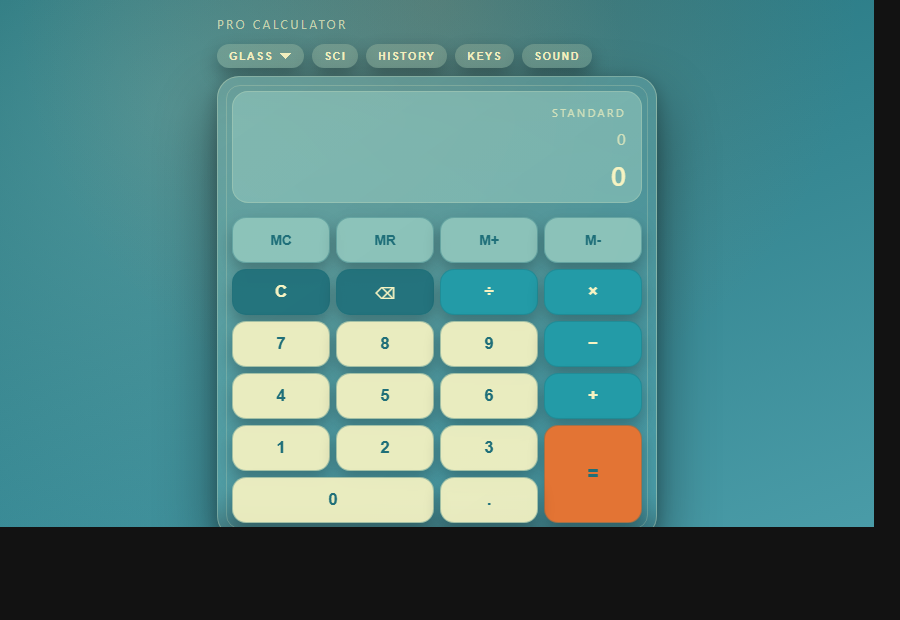
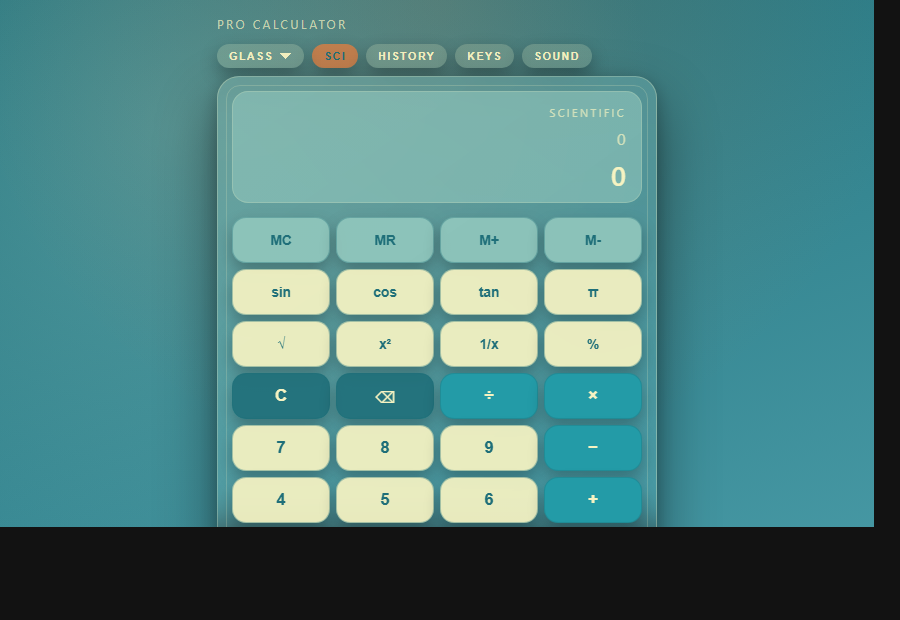

# Pro Calculator

A modern, responsive calculator web app with real-time results, scientific
functions, history tape, theming, and keyboard controls. Built with clean
vanilla HTML, CSS, and JavaScript.

## Preview

Open `index.html` in a browser to try it locally.

## Features

- Standard and scientific operations (sin, cos, tan, √, x², 1/x, π, %)
- Real-time result preview with operator precedence
- Memory keys (MC/MR/M+/M-)
- History tape with a modal viewer + clear action
- Theme switcher (Glass / Dark / Light)
- Keyboard shortcuts and accessible focus states
- Optional click sound toggle

## Tech Stack

- HTML5
- CSS3
- Vanilla JavaScript (no frameworks)

## Getting Started

1. Clone or download the project.
2. Open `index.html` in any modern browser.

Optional: use a local dev server (e.g., VS Code Live Server) for best results.

## Usage

- Click keys or type on your keyboard.
- Press **History** to view the full history panel and clear it.
- Toggle **Sci** to show scientific keys.
- Use the **Theme** selector to switch styles.

## Keyboard Shortcuts

- `0-9` → numbers
- `+ - * /` → operators
- `Enter` or `=` → equals
- `Backspace` → delete
- `Esc` → clear
- `p` → percent
- `P` → π
- `q` → √
- `x` → x²
- `i` → 1/x
- `s` → sin
- `c` → cos
- `t` → tan
- `?` or `h` → open keyboard help

## Scientific Notes

- Trig functions use **degrees** (not radians).
- Divide-by-zero is handled safely with an error state.

## Tests

Open `tests.html` in the browser to run lightweight engine tests.

## Project Structure

- `index.html` – main UI layout
- `style.css` – styling and themes
- `script.js` – UI logic and event handling
- `engine.js` – calculation engine utilities
- `tests.html` / `tests.js` – simple unit tests
- `preview.png` – README preview image
- `preview-sci.png` – scientific mode preview

## Persistence

- Theme, sound setting, and history are stored in `localStorage`.

